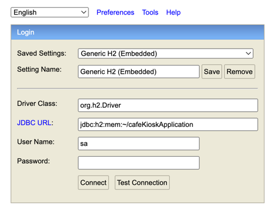

# Section6 - Spring & JPA 기반 테스트
### Layered Architecture
사용자 요청이 왔을 때 Layer 별로 분리를 해서 개발을 해보자 <br>
1) Presentation Layer
2) Business Layer
3) Persistence Layer

추가적으로 Infra Layer 도 있을 수 있다 <br>
도메인 및 회사 마다 부르는 명칭이 다를 수 있다 <br>

#### 레이어드 아키텍쳐는 테스트 하기 복잡해 보인다?
오히려 관심사가 분리되어 있어, Layer 별로 테스트를 진행하기에 더 간편하다고 생각한다 <br>

#### 통합 테스트
- 여러 모듈이 협력하는 기능을 통합적으로 검증하는 테스트
- 일반적으로 작은 범위의 단위 테스트만으로는 기능 전체의 신뢰성을 보장할 수 없다
- 풍부한 단위 테스트 & 큰 기능 단위를 검증하는 통합 테스트

보통 단위 테스트가 많고, 큼직한 시나리오 단위인 통합 테스트 관점으로 나뉜다 <br>

## Spring / JPA 훑어보기&기본 엔티티 설계
- Library -> 능동적
  - 내 코드가 주체이다. 필요한 경우 외부에서 주입받아 사용을 한다.
- Framework -> 수동적
  - 이미 정해진 틀이 있고 내 코드를 틀에 맞춘다

#### Spring
  - IoC(Inversion of Control): 제어의역전
    - 결합도가 너무 높다고 판단하여 결합도를 낮추기 위해서 나옴
    - 객체의 생명주기 자체에 대하여 제3자가 하기로 결정 -> 스프링 컨테이너
    - IoC 컨테이너 == 스프링 컨테이너
    - 객체에 대한 제어권이 내가 아닌 스프링이다.
  - DI(Dependency Injection): 스프링 컨테이너가 객체를 직접 주입해준다.
  - AOP(Aspect Oriented Programming): 관점지향 프로그래밍
    - 비즈니스 흐름과 관계 없는 부가적인 부분을 하나로 모아서 분리를 한다.
      - 프록시를 사용해서 구현을 한다.
    - ex) 트랜잭션, 로깅

#### JPA
- ORM(Object-Relational Mapping)
  - 객체 지향 패러다임과 관계형 DB 패러다임으 불일치
  - 이전에는 개발자가 객체의 데이터를 한개씩 매핑하여 DB 에 저장 및 조회
  - ORM 을 사용함으로써 개발자는 단순 작업을 줄이고, 비즈니스 로직에 집중할 수 있다.

- JPA
  - Java 진영의 ORM 기술 표준
  - 인터페이스이고, 여러 구현체가 있지만 보통 Hibernate 를 많이 사용한다.
  - 반복적인 CRUD SQL 을 생성 및 실행해주고, 여러 부가 기능들을 제공한다.
  - 편리하지만 쿼리를 직접 작성하지 않기 때문에, 어떤 식으로 쿼리가 만들어지고 실행되는지 명확하게 이해하고 있어야 한다.

- Spring Data JPA
  - Spring 진영에는 JPA 를 한번 더 추상화한 Spring Data JPA 제공한다.
  - QueryDSL 과 조합하여 많이 사용한다. (타입체크, 동적쿼리)
  - @Entity @Id @Column
  - @ManyToOne, @OneToMany, @OneToOne, @ManyToMany
    - @ManyToMany 연관관계는 성능상 좋지않아, 일대다-다대일 관계로 풀어서 자주 사용한다

## Persistence Layer 테스트 
### Persistence Layer (1)
#### 요구사항
- 키오스크 주문을 위한 상품 후보 리스트 조회하기
- 상품의 판매 상태: 판매중, 판매보류, 판매중지 -> 판매중, 판매보류인 상태의 상품을 화면에 보여준다
- id, 상풍 번호, 상품 타입, 판매 상태, 상품 이름, 가격

```java
server:
  port: 9000

spring:
  profiles:
    default: local

  jpa:
    hibernate:
      ddl-auto: none

  datasource:
    url: jdbc:h2:mem:~/cafeKioskApplication
    driver-class-name: org.h2.Driver
    username: sa
    password:


--- # local
spring:
  config:
    activate:
      on-profile: local

  jpa:
    show-sql: true
    generate-ddl: true
    hibernate:
      ddl-auto: create
    properties:
      hibernate:
        format_sql: true
    defer-datasource-initialization: true # (boot 2.5~) Hibernate 초기화 이후 data.sql 실행 -> 매번 data insert 가 귀찮으므로 이 기능이 대신 해준다.

  # h2 console 접속 여부
  h2:
    console:
      enabled: true

--- # test
spring:
  config:
    activate:
      on-profile: test

  jpa:
    show-sql: true
    generate-ddl: true
    hibernate:
      ddl-auto: create
    properties:
      hibernate:
        format_sql: true

  datasource:
    url: jdbc:mysql://localhost:3306/practical_test?useSSL=false&useUnicode=true&allowPublicKeyRetrieval=true
    driver-class-name: com.mysql.cj.jdbc.Driver
    username: root
    password: 1234

  sql:
    init:
      mode: never

```

이 yml 파일을 잘 알고 있어야 한다. <br>

#### H2 console 접속
- http://localhost:9000/h2-console 에 접속
 <br>


### Persistence Layer (2)
인터페이스 레포지토리 또한 테스트를 작성하는 것이 좋다 <br>

> @SpringBootTest // 통합 테스트를 위해 제공되는 어노테이션
> > 테스트 실행시 스프링 서버를 띄워서 테스트를 한다.

> @DataJpaTest // Spring 서버를 띄워서 테스트를 한다.
>> @SpringBootTest 보다 가벼워서 JPA 관련 Bean 들만 주입을 해준다.

결론은 통합테스트시 왠만하면 @SpringBootTest 를 선호한다 <br>

```java
@ActiveProfiles("test")
@DataJpaTest
class ProductRepositoryTest {

	@Autowired
	private ProductRepository productRepository;

	@Test
	@DisplayName("원하는 판매상태를 가진 상품들을 조회한디.")
	void ProductRepositoryTest() {
	    // given
		Product product = Product.builder()
			.productNumber("001")
			.type(ProductType.HANDMADE)
			.sellingType(ProductSellingType.SELLING)
			.price(4000)
			.name("아메리카노")
			.build();

		Product product1 = Product.builder()
			.productNumber("002")
			.type(ProductType.HANDMADE)
			.sellingType(ProductSellingType.HOLD)
			.price(4500)
			.name("크룽지")
			.build();

		Product product2 = Product.builder()
			.productNumber("003")
			.type(ProductType.HANDMADE)
			.sellingType(ProductSellingType.STOP_SELLING)
			.price(5000)
			.name("카페라떼")
			.build();
		productRepository.saveAll(List.of(product,product1,product2));

		// when
		List<Product> allBySellingTypeIn = productRepository.findAllBySellingTypeIn(
			List.of(ProductSellingType.SELLING, ProductSellingType.STOP_SELLING.HOLD));

		// then
		Assertions.assertThat(allBySellingTypeIn).hasSize(2)
			.extracting("productNumber","name","sellingType")// 원하는 컬럼만 추출
			.containsExactlyInAnyOrder(
				Tuple.tuple("001","아메리카노",ProductSellingType.SELLING),
				Tuple.tuple("002","크룽지",ProductSellingType.HOLD)
			);
	}
}
```

위와 같은 구조로 레포지토리에 메소드를 검증할 수 있다 <br>


