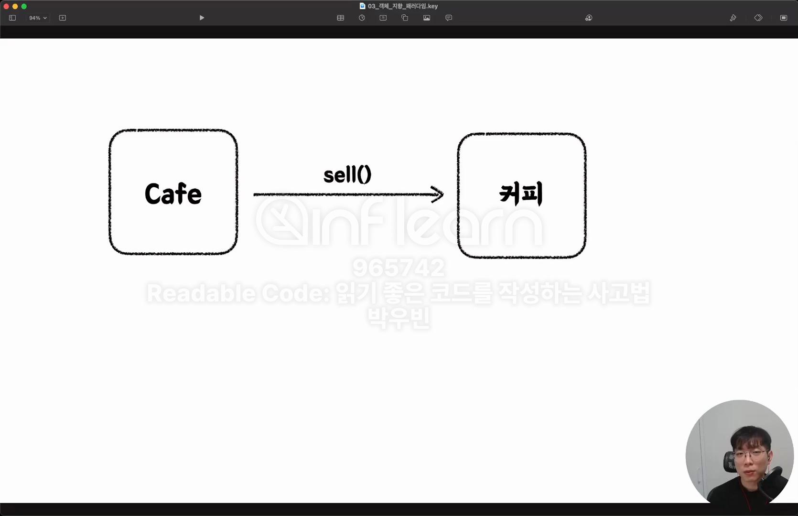

# SOLID
- SRP: Single Responsibility Principle
- OCP: Open-Closed Principle
- LSP: Liskov Substitution Principle
- ISP: Interface Segregation Principle
- DIP: Dependency Inversion Principle

<br>

## SRP: 단일 책임 원칙
- 하나의 클래스는 단 한 가지의 변경 이유만을 가져야 한다.
    - 변경 이유? = 책임
- 객체가 가진 공개 메소드, 필드, 상수 등은 해당 객체의 단일 책임에 의해서만 변경 되는가?
- 관심사의 분리 = 책임의 분리 -> 하나의 책임만 가져야 한다.
- 높은 응집도, 낮은 결합도(=의존성)

'책임' 을 인식하고 구별하는 눈이 필요하다 <br>

```java
public class GameApplication {

	public static void main (String[] args) {
		MineSweeper mineSweeper = new MineSweeper();
		mineSweeper.run();
	}
}
```

기존의 모든 코드들이 한 객체에서 실행이 되었는데, 역할을 분리를 통하여 실행할 클래스, 기능 클래스를 나눴다 <br>
ex) 출력,입력에 따른 객체 분리, 

<br>

## OCP: 개방 폐쇄 원칙
- 확장에는 열려 있고, 수정에는 닫혀 있어야 한다.
  - 기존 코드의 변경 없이, 시스템의 기능을 확장할 수 있어야 한다.
- 추상화와 다형성을 활용해서 OCP 를 지킬 수 있다.
  - interface, abstract 활용

#### 게임의 난이도를 변경할 수 있어야 한다 -> 새로운 요구사항. 
[인터페이스 활용]
```java
// 선언부
public interface GameLevel {
	// 추상화를 다이렉트로 표현한 구조가 인터페이스 이다.
	// 인터페이스가 가지는 스펙들이 메소드 선언부를 선언한다.
	int getRowSize();
	int getColSize();
	int getLandMineCount();
}

// 구현부
public class VeryBeginner implements GameLevel{

  @Override
  public int getRowSize () {
    return 4;
  }

  @Override
  public int getColSize () {
    return 5;
  }

  @Override
  public int getLandMineCount () {
    return 2;
  }

}

public class Beginner implements GameLevel{
  @Override
  public int getRowSize () {
    return 8;
  }

  @Override
  public int getColSize () {
    return 10;
  }

  @Override
  public int getLandMineCount () {
    return 10;
  }

}

public GameBoard (GameLevel gameLevel) {
  int colSize = gameLevel.getColSize();
  int rowSize = gameLevel.getRowSize();
  board = new Cell[rowSize][colSize];

  landMineCount = gameLevel.getLandMineCount();
}

public class GameApplication {

  public static void main (String[] args) {
    GameLevel gameLevel = new Advanced();

    Minesweeper mineSweeper = new Minesweeper(gameLevel);
    mineSweeper.run();
  }
}
```

위 처럼, 선언부를 선언해두고, 구현부를 통해 구체적인 구현을 구한다 <br>
추상화라는 내용 자체가 이해가 하기 어려워서 여러 예시를 보고 배우면서 익숙해지기 위해 노력하고 있습니다 <br>

## LSP: 리스코프 치환 원칙
- 상속 구조에서, 부모 클래스의 인스턴스를 자식 클래스으 인스턴스로 치환할 수 있어야 한다.
  - 자식 클래스는 부모 클래스의 책임을 준수하며, 부모 클래스으 행동을 변경하지 않아야 한다.
- LSP 를 위반하면, 상속 클래스를 사용할 때 오동작, 예상 밖의 예외가 발생하거나, 이를 방지하기 위한 불필요한 타입 체크가 동반될 수 있다.

부모쪽의 기능보다는 자식쪽에 기능이 조금 더 많다 <br>

```java
// 자식 클래스에서 구현해서 사용하겠다는 뜻, 상위 클래스에는 스펙만 가지고 있다
public abstract void turnOnLandMine (); 
```

공통된 메소드는 상위 클래스에서 스펙 + 구현을 통해 공통으로 사용할 수 있게 한다 <br>
프로세스를 생각해보면 이해가 더 쉽다 <br>

## ISP: 인터페이스 분리 원칙
- 클라이언트는 자신이 사용하지 않는 인터페이스에 의존하면 안 된다.
  - 인터페이스를 잘게 쪼개자.
- ISP 를 위반하면, 불필요한 의존성으로 인해 **결합도**가 높아지고, 특정 기능의 변경이 여러 클래스에 영향을 미칠 수 있다.

## DIP: 의존 역전 원칙
- 상위 수준의 모듈은 하위 수준의 모듈에 의존해서는 안된다.
  - 🌟둘 모두 추상화에 의존해야 한다.
- 의존성의 순방향: 고수준 모듈이 저수준 모듈을 참조하는 것
- 의존성의 역방향: 고수준,저수준 모듈이 모두 추상화에 의존하는 것.
  - 저수준 모듈이 변경되어도, 고수준 모듈에는 영향이 가지 않는다.

저수준 모듈은 구체쪽에 가깝기 때문에, 자주 바뀔수도 있다 <br>
그러므로 저수준 모듈의 기능을 추상화해서 고수준 모듈은 추상화된 기능을 스펙만 참고를 하는 것이다 <br>

런타임 시점에 인터페이스를 통해 구현체를 받는다 <br>

고수준 모듈 이랑 저수준 모듈이 서로 의존하지 않고 중간에 추상화를 두고 의존을 하는 방식으로 가게 한다 <br>
저수준 모듈이 자주 변경되어도 고수준 모듈에 영향이 가지 않게 한다 <br>

Cafe - 고수준 모듈 , 커피 - 저수준 모듈 <br>
 <br>

위 어플리케이션을 추상화를 시키면 커피 1개만이 아닌, 음료(beverage) 라는 것 안에 여러개의 음료를 담을 수 있다 <br>
 <br>

보통 최종적 구현에서는 
```java
	public static void main (String[] args) {
		GameLevel gameLevel = new Advanced();
		InputHandler inputHandler = new ConsoleInputHandler();
		OutputHandler outputHandler = new ConsoleOutputHandler();

		Minesweeper mineSweeper = new Minesweeper(gameLevel, inputHandler, outputHandler);
		mineSweeper.initialize();
		mineSweeper.run();
	}
```

생성자에 구현 클래스가 아닌 **인터페이스**가 들어갈 것이고 <br>
구체 클래스는 런타임시에 정해질 것이다. <br>

OOP 는 뭔가 알듯? 말듯? 아리쏭한게 많아서 화가나면서도 끊지를 못하겠다 <br>
계속 생각하게 되고, 뭔가 확실한 답이 보이지 않는 그런 느낌또한 든다 <br>

### 키워드 정리
- 객체,협력과 책임, ⭐️관심사의 분리, 높은 응집도와 낮은 결합도
- getter/setter 자제하기, 객체에 메시지 보내기
- SOLID: SRP, OCP, LSP, ISP, DIP
- Spring DI, IoC 와 DIP 헷갈리지 않기