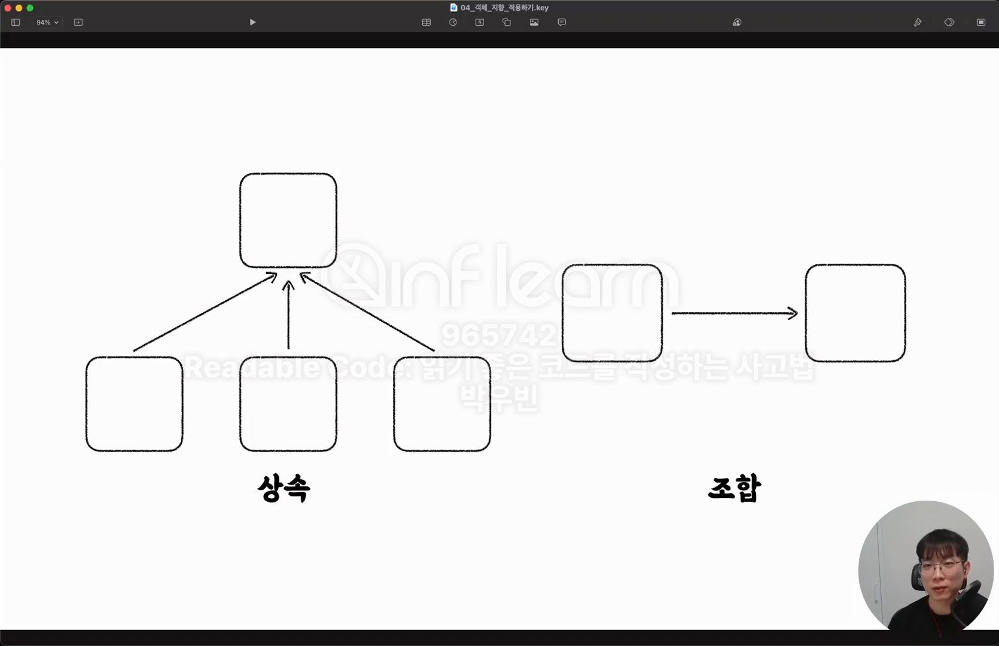

# Section5 - 객체 지향 적용하기

## 상속과 조합
 <br>

- 상속보다 조합을 사용하자!
- 상속은 시멘트처럼 굳어지는 구조다. 즉 수정이 어렵다
  - 부모와 자식의 결합도가 높다.
  - 상속 디자인 자체가 결합도가 높은 디자인이다.
  - 상속을 무조건 사용하지 말자는 아니고, 상속이 더 큰 효율(=절대 변하지않는?) 을 가져다 주는 구조가 아니면 굳이 안쓰는게 좋다.
- 🌟조합과 인터페이스를 활용하는 것이 유연한 구조
  - 상속을 통한 코드의 중복 제거가 주는 이점보다, 중복이 생기더라도 유연한 구조 설계가 주는 이점이 더 크다.

```java
public abstract class Cell {
	protected boolean isFlagged;
	protected boolean isOpened;

}

public class EmptySell extends Cell {
	protected static final String EMPTY_SIGN = "◼";

	@Override
	public String getSign () {
		if(isOpened) { // 부모 필드 사용
			return EMPTY_SIGN;
		}
		if(isFlagged) { // 부모 필드 사용
			return FLAG_SIGN;
		}
		return UNCHECKED_SIGN;
	}
}
```

위 같은 코드는 부모, 자식 간의 높은 결합도를 보여주는 코드이다 <br>
부모 필드에 변경이 생긴다면? 모든 자식 모듈 또한 변경이 되어야 할 것이다 <br>

위 같은 코드를 상속이 아닌, '조합' 을 사용해서 풀어가 보자 <br>
```java
public class CellState {

	private boolean isFlagged;
	private boolean isOpened;

	public CellState (boolean isFlagged, boolean isOpened) {
		this.isFlagged = isFlagged;
		this.isOpened = isOpened;
	}

	public static CellState initialize() {
		return new CellState(false, false);
	}

	public void flag () {
		this.isFlagged = true;
	}

	public boolean isChecked () {
		return isFlagged || isOpened;
	}

	public void open () {
		this.isOpened = true;
	}

	public boolean isOpened () {
		return isOpened;
	}

	public boolean isFlagged () {
		return isFlagged;
	}

}
```

상속은 보통, 조합을 통해 대부분 해결을 할 수 있다, 실무에서는 복잡한 비즈니스가 많으므로 최대한 상속대신 조합을 사용하자 <br>

## Value Object
- 유명한 추상화 기법이다.
- 도메인의 어떤 개념을 추상화하여 표현한 값 객체
- 값으로 취급하기 위해서, 불변성, 동등성, 유효성 검증 등을 보장해야 한다.
  - 불변성: final 필드, setter 금지
  - 동등성: 메모리가 주소가 다른, 즉 서로 다른 인스턴스 여도(동일성이 달라도), 내부의 값이 같으면 같은 값 객체로 취급한다.
    - equals() & hashCode() 재정의 필요.
    - ex) 만원짜리 5개가 있다, 각 지폐는 고유의 일련번호가 있다. 이거랑 비슷한 느낌이 있다.
      - 일련번호(=메모리 주소)가 다르지만, 고유의 역할은 다 똑같다. 서로 다른 인스턴스여도, 결국 내부 값(=필드) 는 같은 인스턴스이다. ex) DTO, Entity
  - 유효성 검증: 객체가 생성되는 시점에 값에 대한 유효성을 보장하기
  
- **VO vs Entity**
- **1차 조건**
- 식별자가 있다면? **Entity**
  - 식별자가 아닌 필드의 값이 달라도, 식별자가 같으면 동등한 객체로 취급한다.
  - equals() & hashCode() 도 식별자 필드만 가지고 재정의할 수 있다.
  - 식별자가 같은데 식별자가 아닌 필드의 값이 서로 다른 두 인스턴스가 있다면, 같은 Entity 가 시간이 지남에 따라 변화한 것으로 이해할 수도 있다.
  

  - 식별자가 없다면? **VO(=DTO)**
    - 식별자가 없어 내부을 모든 값이 다 같아야 동등한 객체로 취급한다.
      - 개념적으로 전체 필드가 다같이 식별자 역할을 한다고 생각해도 된다.

```java
public class RelativePosition {
	private final int deltaRow;
	private final int deltaCol;

	public RelativePosition (int deltaRow, int deltaCol) {
		this.deltaRow = deltaRow;
		this.deltaCol = deltaCol;
	}

	public static RelativePosition of(int deltaRow, int deltaCol) {
		return new RelativePosition(deltaRow, deltaCol);
	}

	@Override
	public boolean equals (Object o) {
		if (this == o)
			return true;
		if (o == null || getClass() != o.getClass())
			return false;
		RelativePosition that = (RelativePosition)o;
		return deltaRow == that.deltaRow && deltaCol == that.deltaCol;
	}

	@Override
	public int hashCode () {
		return Objects.hash(deltaRow, deltaCol);
	}

}
```

- 동등성 보장을 위한 equals & hashCode 를 만들어 준다.

## 일급 컬렉션

<br>

## Enum 의 특성과 활용


<br>

## 다형성 활용하기


